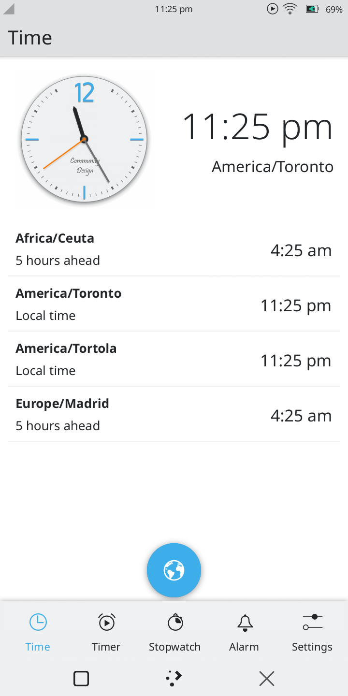
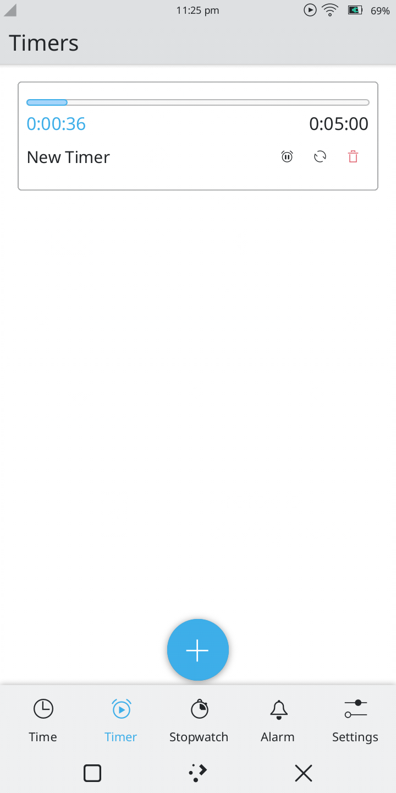
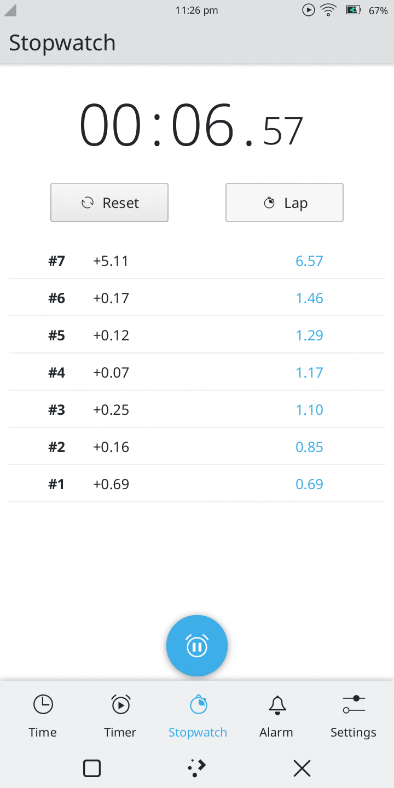
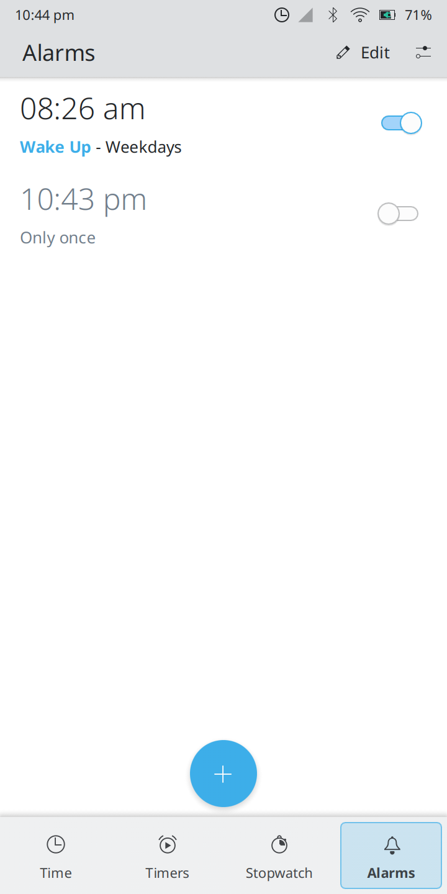
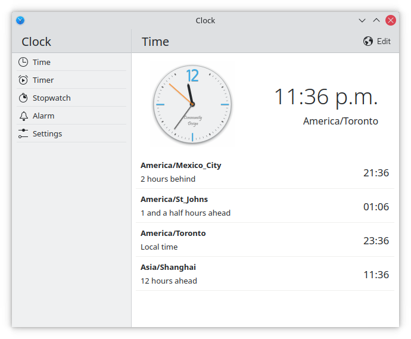
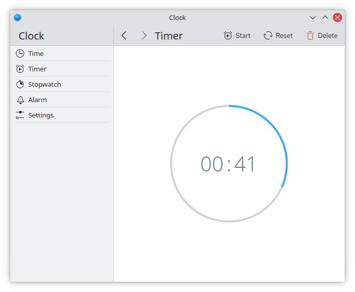

<!--
- Copyright 2020 Han Young <hanyoung@protonmail.com>
- Copyright 2020 Devin Lin <espidev@gmail.com>
- SPDX-License-Identifier: GPL-2.0-or-later
-->

# KClock  
A convergent clock application for Plasma.

<a href='https://flathub.org/apps/details/org.kde.kclock'></a>

## Features
* Alarms
* Stopwatch
* World Clocks
* Timers

## Links
* Project page: https://invent.kde.org/plasma-mobile/kclock
* File issues: https://invent.kde.org/plasma-mobile/kclock/-/issues
* Development channel: https://matrix.to/#/#plasmamobile:matrix.org

## Installing
This will compile and install kclock, kclockd, and the plasmoids onto the system. When running kclock, make sure that kclockd is running first (it is configured to autostart in sessions).

```
mkdir build
cd build
cmake .. # add -DCMAKE_BUILD_TYPE=Release to compile for release
make
sudo make install
```

## Components
KClock is split into three components: **kclock** (front-end), **kclockd** (backend-daemon), and **plasmoids**.

### `kclockd`
The background daemon, which is configured to autostart. It has the following responsibilities:
* Schedule wakeups with [PowerDevil](https://invent.kde.org/plasma/powerdevil), which handles waking from suspend for alarms and timers.
* Exposing alarms, timers, and settings models via a D-Bus interface.
* Alarm/Timer notifications and ringing audio.
* Indicator on system tray for pending alarms.

`kclockd` exposes its API in D-Bus under the service name `org.kde.kclockd`. Front-end applications like `kclock` and its plasmoids completely depend on it for clock functionality, which allows alarms and timers to function in the background when the front-end applications are not running.

If PowerDevil is detected, it will use PowerDevil's scheduleWakeup feature to wakeup for alarm notifications. 

If you want to disable this behaviour, pass the `--no-powerdevil` option when launching kclockd. Note that while running in `--no-powerdevil` mode, kclockd will fail to keep track of time if the system sleeps, which is quite common for mobile devices.

`kclockd` will automatically start up in `--no-powerdevil` mode and not have suspend waking functionality if:
* PowerDevil is not running (ex. on GNOME, Phosh, etc.)
* On BSD system

#### `kclockd` D-Bus interface
After installing, five D-Bus interface XML files are copied to the KDE D-Bus interface directory. 

These are:
* org.kde.kclockd.KClockSettings.xml
* org.kde.kclockd.Alarm.xml
* org.kde.kclockd.AlarmModel.xml
* org.kde.kclockd.TimerModel.xml
* org.kde.kclockd.Timer.xml

These files can be used to generate the D-Bus adaptor. Alarm and Timer will be registered under path "/Alarms/" or "/Timers/" + its uuid's Id128 string representation (ex. *8c7d59b3befa49a48853959fe7e025d7*). However, the "remove" slots in AlarmModel or TimerModel only accept its normal representation, (ex. *{8c7d59b3-befa-49a4-8853-959fe7e025d7}*). One can get the normal string by calling the getUUID() method in each alarm/timer. Timer is in seconds precision, but you may want to call elapsed() method every 500ms or so to avoid going out of sync with kclockd. 

### `kclock`
A front end for kclockd written in Kirigami for Plasma Mobile and the desktop.

Run with these environment variables to have mobile controls:
```
QT_QUICK_CONTROLS_MOBILE=true kclock
```

### Plasmoids
Various plasmoids for kclockd exist, and some also communicate with [KWeather](https://invent.kde.org/plasma-mobile/kweather).

Currently we have two plasmoids, expect more in the future.

Intended to provide `widgets` similar to those you can find on mainstream mobile platforms.

## Gallery







